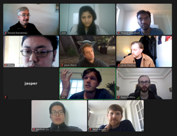

## Welcome to Robotic Imaging Readng Group

This page keeps track of the on-going imaging reading group activities. You will be able to find the schedule of the upcoming reading sessions, past presentations, related articles and a curated list of resources on imaging.

The meetings are held every **Friday between 14:00 - 15:00 in hybrid mode: in-person at J04 conference room, Rose Street Building, Australian Centre for Field Robotics (ACFR), The University of Sydney, NSW, Australia and via Zoom**. If you like to join Robotic Imaging Reading Group, feel free to contact us. 

## Upcoming Reading Sessions

| Date | Presenter | Paper Title | Related Link |   
| ---------| ----------- | ---------| ----------- |
| 23.07.2021 | Dr. Tejaswi Digumarti | TBA | TBA|
| 30.07.2021 | Dr. Mitch Bryson | TBA | TBA |
| 06.08.2021 | Jesse | TBA | TBA |
| 13.08.2021 | Ryan | TBA | TBA |
| 20.08.2021 | Jacob | TBA | TBA |
| 27.08.2021 | Jasper | TBA | TBA |
| 03.09.2021 | Dr. Donald Dansereau | TBA | TBA |
| 10.09.2021 | Liu | TBA | TBA |
| 17.09.2021 | Will | TBA | TBA |
| 24.09.2021 | Ziting | TBA | TBA |
| 01.10.2021 | Avie | TBA | TBA |

## Past Presentations

| Date | Presenter | Date | Presenter |  
| ---------| ----------- | ---------| ----------- |
| 16.07.2021 | Reboot Meeting | 2-3 minutes presentation by each member | Multiple recent papers |

## Paper Suggestions for Presentation
* [Blocks-World Camera](https://wisionlab.cs.wisc.edu/wp-content/uploads/2021/05/CVPR21_Blocks_World_Cameras_combined.pdf) Lee, J. and Gupta, M., 2021. Blocks-World Cameras. In Proceedings of the IEEE/CVF Conference on Computer Vision and Pattern Recognition (pp. 11412-11422).
* [MBA-VO: Motion Blur Aware Visual Odometry](https://arxiv.org/pdf/2103.13684.pdf) Liu, P., Zuo, X., Larsson, V. and Pollefeys, M., 2021. MBA-VO: Motion Blur Aware Visual Odometry. arXiv preprint arXiv:2103.13684.
* [A Physics-based Noise Formation Model for Extreme Low-light Raw Denoising](https://arxiv.org/abs/2003.12751) Wei, K., Fu, Y., Yang, J. and Huang, H., 2020. A physics-based noise formation model for extreme low-light raw denoising. In Proceedings of the IEEE/CVF Conference on Computer Vision and Pattern Recognition (pp. 2758-2767).
* [ACORN: Adaptive Coordinate Networks for Neural Representation](https://arxiv.org/pdf/2105.02788.pdf) Martel, J.N., Lindell, D.B., Lin, C.Z., Chan, E.R., Monteiro, M. and Wetzstein, G., 2021. ACORN: Adaptive Coordinate Networks for Neural Scene Representation. arXiv preprint arXiv:2105.02788.
* [Motion Adaptive Deblurring with Single-Photon Cameras](https://arxiv.org/abs/2012.07931) Seets, T., Ingle, A., Laurenzis, M. and Velten, A., 2021. Motion Adaptive Deblurring with Single-Photon Cameras. In Proceedings of the IEEE/CVF Winter Conference on Applications of Computer Vision (pp. 1945-1954).
* [Single-Image HDR Reconstruction by Learning to Reverse the Camera Pipeline](https://arxiv.org/abs/2004.01179) Liu, Y.L., Lai, W.S., Chen, Y.S., Kao, Y.L., Yang, M.H., Chuang, Y.Y. and Huang, J.B., 2020. Single-image HDR reconstruction by learning to reverse the camera pipeline. In Proceedings of the IEEE/CVF Conference on Computer Vision and Pattern Recognition (pp. 1651-1660).
* [MaskFlownet: Asymmetric Feature Matching with Learnable Occlusion Mask](https://arxiv.org/abs/2003.10955). Zhao, S., Sheng, Y., Dong, Y., Chang, E.I. and Xu, Y., 2020. Maskflownet: Asymmetric feature matching with learnable occlusion mask. In Proceedings of the IEEE/CVF Conference on Computer Vision and Pattern Recognition (pp. 6278-6287).
* [Warp to the Future: Joint Forecasting of Features and Feature Motion](https://ieeexplore.ieee.org/document/9157463) Saric, J., Orsic, M., Antunovic, T., Vrazic, S. and Segvic, S., 2020. Warp to the future: Joint forecasting of features and feature motion. In Proceedings of the IEEE/CVF Conference on Computer Vision and Pattern Recognition (pp. 10648-10657).
* [Back to the Feature: Learning Robust Camera Localization from Pixels to Pose](https://arxiv.org/abs/2103.092130) Sarlin, P.E., Unagar, A., Larsson, M., Germain, H., Toft, C., Larsson, V., Pollefeys, M., Lepetit, V., Hammarstrand, L., Kahl, F. and Sattler, T., 2021. Back to the Feature: Learning Robust Camera Localization from Pixels to Pose. In Proceedings of the IEEE/CVF Conference on Computer Vision and Pattern Recognition (pp. 3247-3257).
* [Unsupervised Learning of Depth and Ego-Motion from Video](https://people.eecs.berkeley.edu/~tinghuiz/projects/SfMLearner/) Zhou, T., Brown, M., Snavely, N. and Lowe, D.G., 2017. Unsupervised learning of depth and ego-motion from video. In Proceedings of the IEEE conference on computer vision and pattern recognition (pp. 1851-1858).
* [Looking Beyond Two Frames: End-to-End Multi-Object Tracking Using Spatial and Temporal Transformers](https://arxiv.org/pdf/2103.14829.pdf) Zhu, T., Hiller, M., Ehsanpour, M., Ma, R., Drummond, T. and Rezatofighi, H., 2021. Looking Beyond Two Frames: End-to-End Multi-Object Tracking Using Spatial and Temporal Transformers. arXiv preprint arXiv:2103.14829.
* [Dirty Pixels: Towards End-to-End Image Processing and Perception](https://arxiv.org/abs/1701.06487) Diamond, S., Sitzmann, V., Julca-Aguilar, F., Boyd, S., Wetzstein, G. and Heide, F., 2021. Dirty Pixels: Towards End-to-end Image Processing and Perception. ACM Transactions on Graphics (TOG), 40(3), pp.1-15.
* [CodedStereo: Learned Phase Masks for Large Depth-of-field Stereo](https://arxiv.org/pdf/2104.04641.pdf) Tan, S., Wu, Y., Yu, S.I. and Veeraraghavan, A., 2021. CodedStereo: Learned Phase Masks for Large Depth-of-field Stereo. In Proceedings of the IEEE/CVF Conference on Computer Vision and Pattern Recognition (pp. 7170-7179).
* [Fourier Features Let Networks Learn High Frequency Functions in Low Dimensional Domains](https://arxiv.org/pdf/2006.10739.pdf) Tancik, M., Srinivasan, P.P., Mildenhall, B., Fridovich-Keil, S., Raghavan, N., Singhal, U., Ramamoorthi, R., Barron, J.T. and Ng, R., 2020. Fourier features let networks learn high frequency functions in low dimensional domains. arXiv preprint arXiv:2006.10739.
* [Holographic Optics for Thin and Lightweight Virtual Reality](https://dl.acm.org/doi/abs/10.1145/3386569.3392416) Maimone, A. and Wang, J., 2020. Holographic optics for thin and lightweight virtual reality. ACM Transactions on Graphics (TOG), 39(4), pp.67-1.
* [Consistent Video Depth Estimation](https://dl.acm.org/doi/pdf/10.1145/3386569.3392377) Luo, X., Huang, J.B., Szeliski, R., Matzen, K. and Kopf, J., 2020. Consistent video depth estimation. ACM Transactions on Graphics (TOG), 39(4), pp.71-1.
* [Portrait Shadow Manipulation](https://dl.acm.org/doi/10.1145/3386569.3392390) Zhang, X., Barron, J.T., Tsai, Y.T., Pandey, R., Zhang, X., Ng, R. and Jacobs, D.E., 2020. Portrait shadow manipulation. ACM Transactions on Graphics (TOG), 39(4), pp.78-1.
* [RoboCut: Hot-wire Cutting with Robot-controlled Flexible Rods](https://dl.acm.org/doi/abs/10.1145/3386569.3392465) Duenser, S., Poranne, R., Thomaszewski, B. and Coros, S., 2020. RoboCut: hot-wire cutting with robot-controlled flexible rods. ACM Transactions on Graphics (TOG), 39(4), pp.98-1.
* [Compact snapshot hyperspectral imaging with diffracted rotation](https://dl.acm.org/doi/10.1145/3306346.3322946) Jeon, D.S., Baek, S.H., Yi, S., Fu, Q., Dun, X., Heidrich, W. and Kim, M.H., 2019. Compact snapshot hyperspectral imaging with diffracted rotation.
* [Wave-Based Non-Line-of-Sight Imaging using Fastf−kMigration](https://dl.acm.org/doi/pdf/10.1145/3306346.3322937) Lindell, D.B., Wetzstein, G. and O'Toole, M., 2019. Wave-based non-line-of-sight imaging using fast fk migration. ACM Transactions on Graphics (TOG), 38(4), pp.1-13.
* [PuppetMaster: robotic animation of marionettes](https://dl.acm.org/doi/10.1145/3306346.3323003) Zimmermann, S., Poranne, R., Bern, J.M. and Coros, S., 2019. PuppetMaster: robotic animation of marionettes. ACM Transactions on Graphics (TOG), 38(4), pp.1-11.
* [Multi-view relighting using a geometry-aware network](https://dl.acm.org/doi/10.1145/3306346.3323013) Philip, J., Gharbi, M., Zhou, T., Efros, A.A. and Drettakis, G., 2019. Multi-view relighting using a geometry-aware network. ACM Transactions on Graphics (TOG), 38(4), pp.1-14.
* [Deep reflectance fields: high-quality facial reflectance field inference from color gradient illumination](https://dl.acm.org/doi/10.1145/3306346.3323027) Meka, A., Haene, C., Pandey, R., Zollhöfer, M., Fanello, S., Fyffe, G., Kowdle, A., Yu, X., Busch, J., Dourgarian, J. and Denny, P., 2019. Deep reflectance fields: high-quality facial reflectance field inference from color gradient illumination. ACM Transactions on Graphics (TOG), 38(4), pp.1-12.
* [Distortion-free wide-angle portraits on camera phones](https://dl.acm.org/doi/10.1145/3306346.3322948) Shih, Y., Lai, W.S. and Liang, C.K., 2019. Distortion-free wide-angle portraits on camera phones. ACM Transactions on Graphics (TOG), 38(4), pp.1-12.
* [Hyperparameter Optimization in Black-box Image Processing usingDifferentiable Proxies](https://dl.acm.org/doi/pdf/10.1145/3306346.3322996) Tseng, E., Yu, F., Yang, Y., Mannan, F., Arnaud, K.S., Nowrouzezahrai, D., Lalonde, J.F. and Heide, F., 2019. Hyperparameter optimization in black-box image processing using differentiable proxies. ACM Trans. Graph., 38(4), pp.27-1.

## Curated list of Robotic Imaging Resources
### A curated list of awesome robotic imaging resources
* [Awesome Robotic Imaging](https://github.com/avie00/Awesome-Robotic-Imaging)
### Upcoming Conferences 
* [SIGGRAPH](https://s2021.siggraph.org/) - Graphics
* [NeurIPS Proceedings](https://nips.cc/) - Robotic Imaging; Machine Learning
* [Computer Vision Foundation open access](http://cvpr2022.thecvf.com/) - Robotic Imaging; Computer Vision
* [ICRA: 2022 IEEE International Conference on Robotics and Automation](https://www.icra2022.org/) - Robotic Imaging
* [IROS: 2021 IEEE/RSJ International Conference on Intelligent Robots and Systems](https://www.iros2021.org/) - Robotic Imaging
* [ICCV 2021: International Conference on Computer Vision](http://iccv2021.thecvf.com/home) - Robotic Imaging; Computer Vision
* [ECCV 2022: European Conference on Computer Vision]() - Robotic Imaging; Computer Vision

### Recent Conferences
* [SIGGRAPH](https://s2020.siggraph.org/wp-content/uploads/2020/08/tog394firstpages.pdf) - Graphics
* [NeurIPS Proceedings](https://proceedings.neurips.cc//) - Robotic Imaging; Machine Learning
* [Computer Vision Foundation open access](https://openaccess.thecvf.com/menu) - Robotic Imaging; Computer Vision
* [ICRA: 2020 IEEE International Conference on Robotics and Automation](https://github.com/dectrfov/ICRA2021PaperList) - Robotic Imaging
* [IROS: 2020 IEEE/RSJ International Conference on Intelligent Robots and Systems](https://github.com/PaoPaoRobot/IROS2020-paper-list) - Robotic Imaging
* [ICCP 2021: International Conference on Computational Photography](https://iccp-conference.org/) - Robotic Imaging; Computational Imaging
* [ECCV 2020: European Conference on Computer Vision](https://eccv2020.eu/) - Robotic Imaging; Computer Vision

### Contact Us
{::nomarkdown}
<form
  action="https://formspree.io/f/xbjqazgp"
  method="POST"
>
  <label>
    Your email:
    <input type="email" name="_replyto">
  </label>
  <label>
    Your message:
    <textarea name="message"></textarea>
  </label>
<button type="submit">Send</button>
</form>
{:/nomarkdown}

### Gallery

  

Credits: Dr. Donald Dansereau
